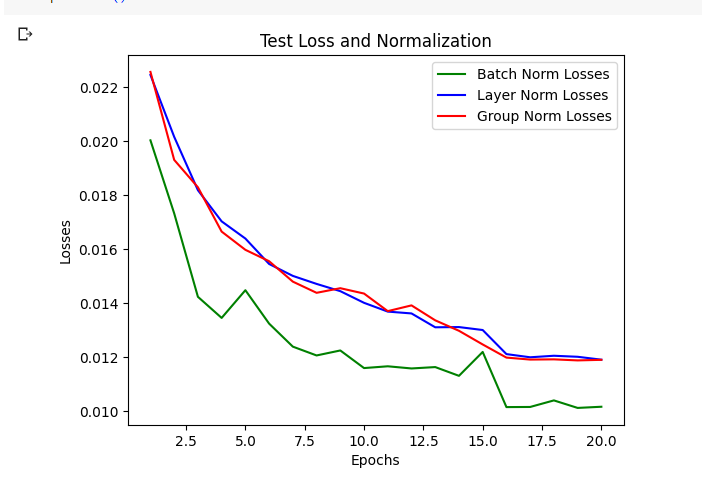

# ERA_V1_S8
The objective of the assignment is to observe the effect of different kind of Normalization using CIFAR 10 dataset

- Loss using different Normalization
  -  For batch size = 64, and keeping all the hyperparameters same,it is observed the Batch Normalization gives best accuracy for 20 epochs.
  -  The performance of Group and Layer Norm is almost comaprable and loss is converging by 20 epochs.
  
  

-  Batch Normalization
   -  Best Train Accuracy: 79.91%   Best Test Accuracy: 77.58%
   -  Summary
      

   -  Loss and Accuracy
      

   -  Misclassified Images
      

-  Layer Normalization
   -  Best Train Accuracy: 76.45%   Best Test Accuracy: 73.58%
   -  Summary
      

   -  Loss and Accuracy
      

   -  Misclassified Images
      

-  Group Normalization - used Group Size: 8
   -  Best Train Accuracy: 76.29%   Best Test Accuracy: 73.96%
   -  Summary
      

   -  Loss and Accuracy
      

   -  Misclassified Images
      
      
      

